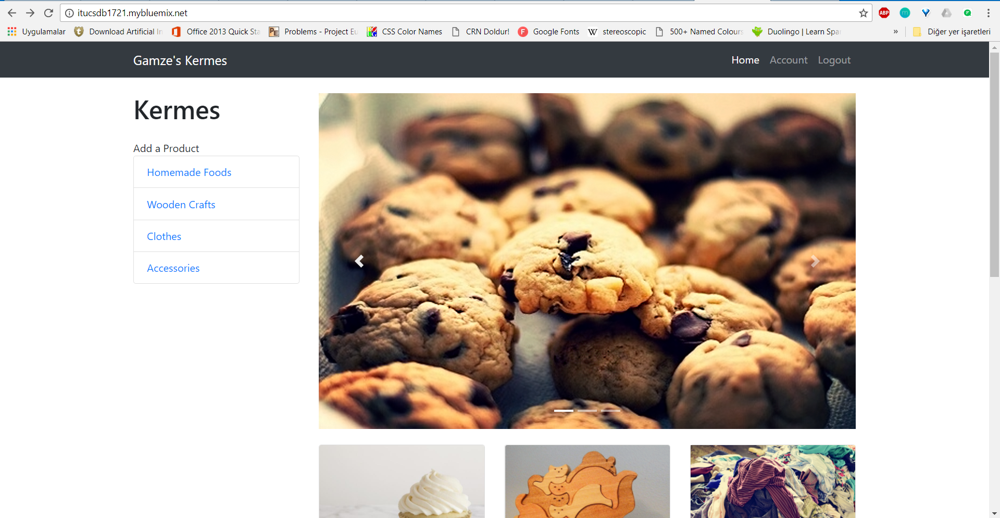
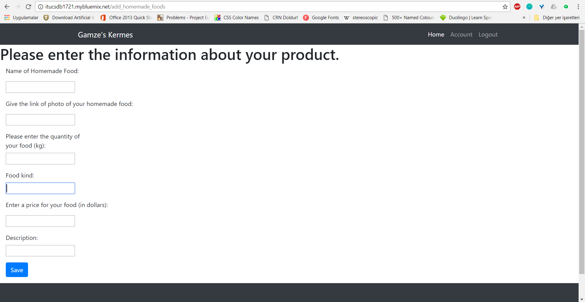
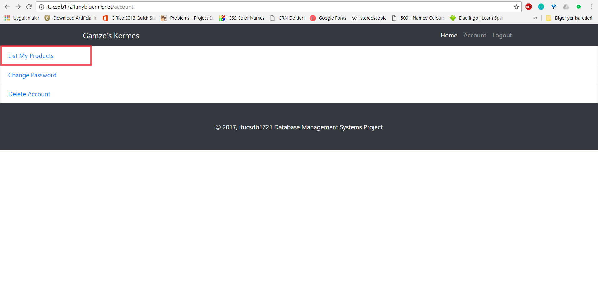
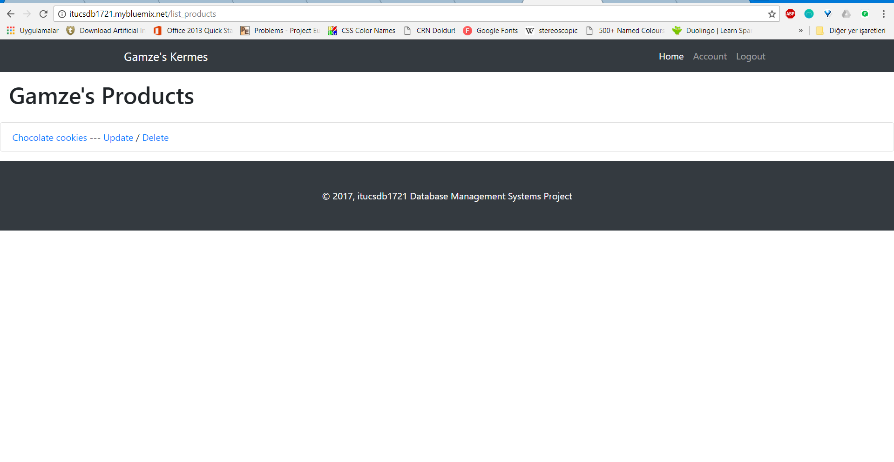
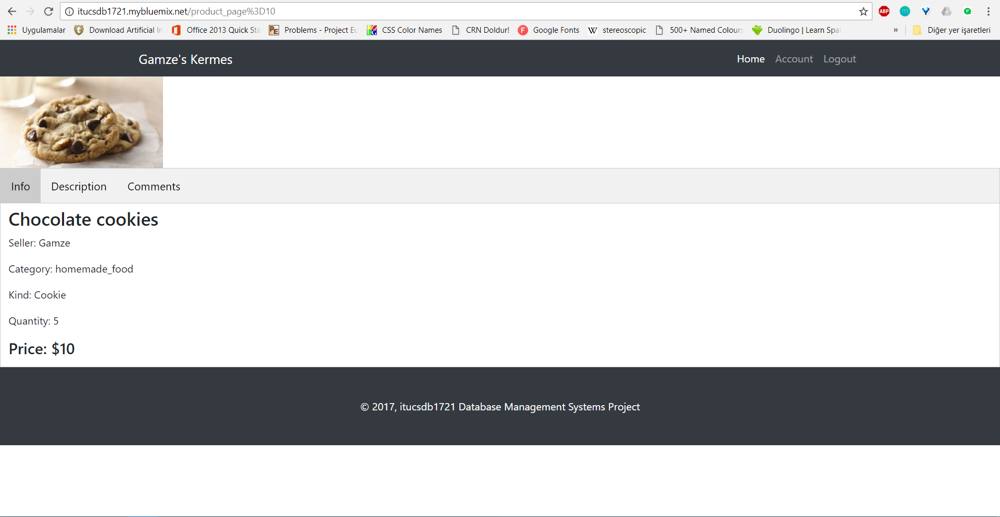
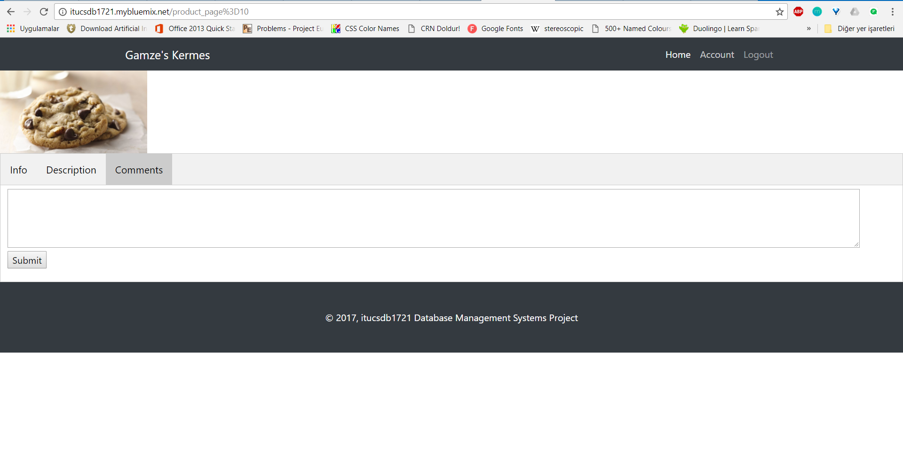

Parts Implemented by Gamze Akyol
================================

** Homemade foods, wooden crafts and accessories tables are implemented.**

Firstly, you should register, then log in to Kermes to add all of these products to the website.

Homemade Foods
--------------

Homemade foods can be added to the website via "Homemade Foods" button in the navigation bar which is located in left side of the home page.

 Figure 1.1:

Figure 1.1 is a screenshot of the home page which shows the add button for Homemade Foods in the navigation bar.

When you click on the "Homemade Foods" button located in navigation bar, you will see the page which is shown in Figure 1.2.

 Figure 1.2:

When you fill the boxes which are related to properties of the product, your homemade food will be added to the website.

 Figure 1.3:

      
You can see your added products from the "List My Products" link (Figure 1.3) which is in account page.

 Figure 1.4:

      
When you click "List My Products" link which is in Figure 1.3, you will see the page which is shown in below in Figure 1.4. You can see your product's properties, update your product's properties or delete your product from this page.

When you click on the name of your product (in this example, "Chocolate cookies") you will see the page which includes product's properties. The info page of the product is shown in Figure 1.5.

 Figure 1.5:

      
You can also comment to the products which is shown like in Figure 1.6.

 Figure 1.6:

Wooden Crafts
-------------
Wooden craft operations are similar to homemade food operations.

Accessories
-----------
Accessories operations are similar to homemade food operations.

